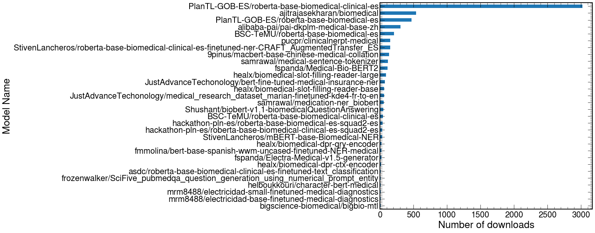
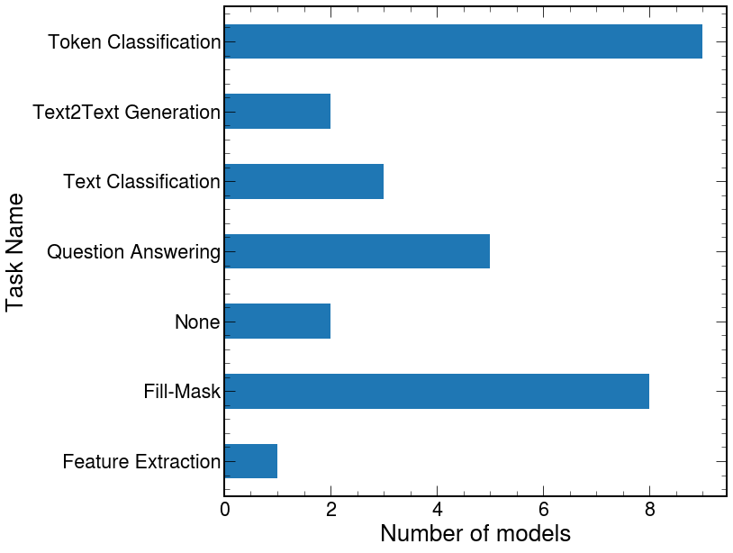
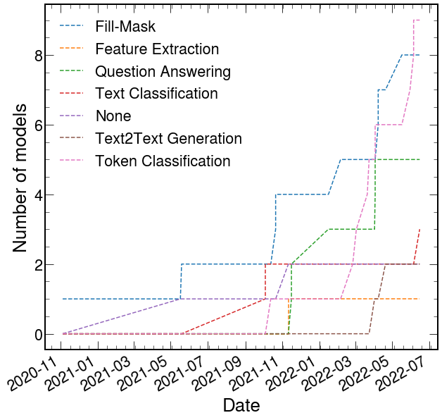

# Medical models

[Hugging Face](https://huggingface.co/) currently contains [62 models](https://huggingface.co/models?search=medical).

The most downloaded models are shown below.

<figure markdown>
  { width="600" }
  <figcaption>Number of downloads of the 30 most downloaded models on HF.</figcaption>
</figure>

Most of the downloaded models relate to Fill-Mask and Token Classification.

<figure markdown>
  { width="600" }
  <figcaption>Number of models per task (for the 30 most downloaded models).</figcaption>
</figure>

The dynamic of model uploads (using only the 30 more downloaded models) can be seen below.

<figure markdown>
  { width="600" }
  <figcaption>Cumulative sum of models per task (for the 30 most downloaded models).</figcaption>
</figure>

